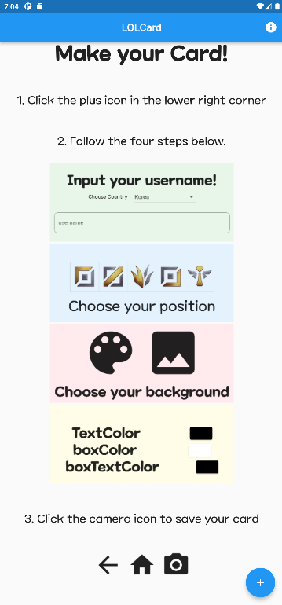

# LOLCard
The purpose of this project is to create cards based on information from League of Legends(LOL) users.  
League of Legends users' levels, tiers, winning rates, summoner icons, and Most Champion information are used in cards.  
If you want to show off your LOL career, try this project!

# This Project
* The LOL information used in this project comes from `OP.GG`, the League of Legends stats search engine. 
* Users of this program can get their own cards by simply performing simple tasks such as entering the summoner's name and selecting the position they usually go to. 
* The card is provided as an image file (of course, you can save it in your own gallery) 

# How To Use

1. Click the plus icon in the lower right corner.

2. Follow the four steps below.
* input username
* choose position
* choose background 
* choose text color, box color, boxtext color

3. Click the camera icon to save your card.

# copyright
* The image files for `.\assets\positions` directory and `.\assets\ranked-emblems` directory are taken from the link below.  
https://developer.riotgames.com/docs/lol
* [LOLCard] was created under Riot Games' "Legal Jibber Jabber" policy using assets owned by Riot Games.  
Riot Games does not endorse or sponsor this project.
* [LOLCard] isn't endorsed by Riot Games and doesn't reflect the views or opinions of Riot Games or anyone officially involved in producing or managing Riot Games properties. Riot Games, and all associated properties are trademarks or registered trademarks of Riot Games, Inc.
* Please check the link below for Riot Intellectual Property Utilization Policy  
  https://www.riotgames.com/en/legal
* Summoner records, rank information, etc. are obtained from [OP.GG](https://www.op.gg/).